# Procesverslag
Markdown is een simpele manier om HTML te schrijven.  
Markdown cheat cheet: [Hulp bij het schrijven van Markdown](https://github.com/adam-p/markdown-here/wiki/Markdown-Cheatsheet).

Nb. De standaardstructuur en de spartaanse opmaak van de README.md zijn helemaal prima. Het gaat om de inhoud van je procesverslag. Besteedt de tijd voor pracht en praal aan je website.

Nb. Door *open* toe te voegen aan een *details* element kun je deze standaard open zetten. Fijn om dat steeds voor de relevante stuk(ken) te doen.

## Jij

  
uitwerken voor kick-off werkgroep

  ### Auteur:
  Sander den Braver (vervangen door jouw naam)

  #### Je startniveau:
  blauw (kies uit zwart, rood óf blauw)

  #### Je focus:
  Responsive (kies uit responsive óf surface plane)
 

## Je website

  
uitwerken voor kick-off werkgroep

  ### Je opdracht:
  https://www.osdorp.nl/

  #### Screenshot(s) van de eerste pagina (small screen): 
  Homepagina 
  

  #### Screenshot(s) van de tweede pagina (small screen):
  Tuinmeubelen
  

## Toegankelijkheidstest 1/2 (week 1)

  
uitwerken na test in 2e werkgroep

  ### Bevindingen
  Lijst met je bevindingen die in de test naar voren kwamen:
  De volgorde gaat soms niet helemaal goed voor mijn gevoel, doordat het raar wisselt met de naar beneden knop. 
  Ik kan niet bij de cadeaubon stukje komen waar je je kan inschrijven met je e-mailadres om een cadeaubon te winnen. Ik kan dit dus niet invullen en ook niet op versturen klikken, want hij slaat het hele gedeelte over.
  Met de tuinmebeulen pagina slaat de voiceover teksten over. Hiermee bedoel ik dat de voiceover alleen naar links gaat in een tekst en als je vervolgens omlaag gaat dan gaat hij weer naar een ander kopje toe waar een link in staat.

   
   
   
   
   

## Breakdownschets (week 1)

  
uitwerken na afloop 3e werkgroep

  ### de hele pagina: 
  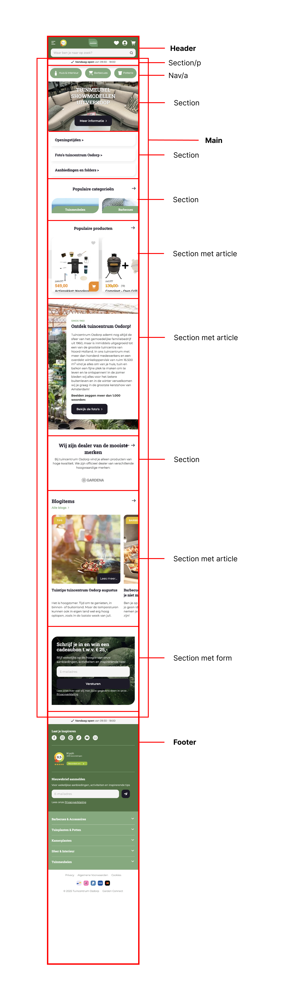

  ### dynamisch deel (bijv menu): 
  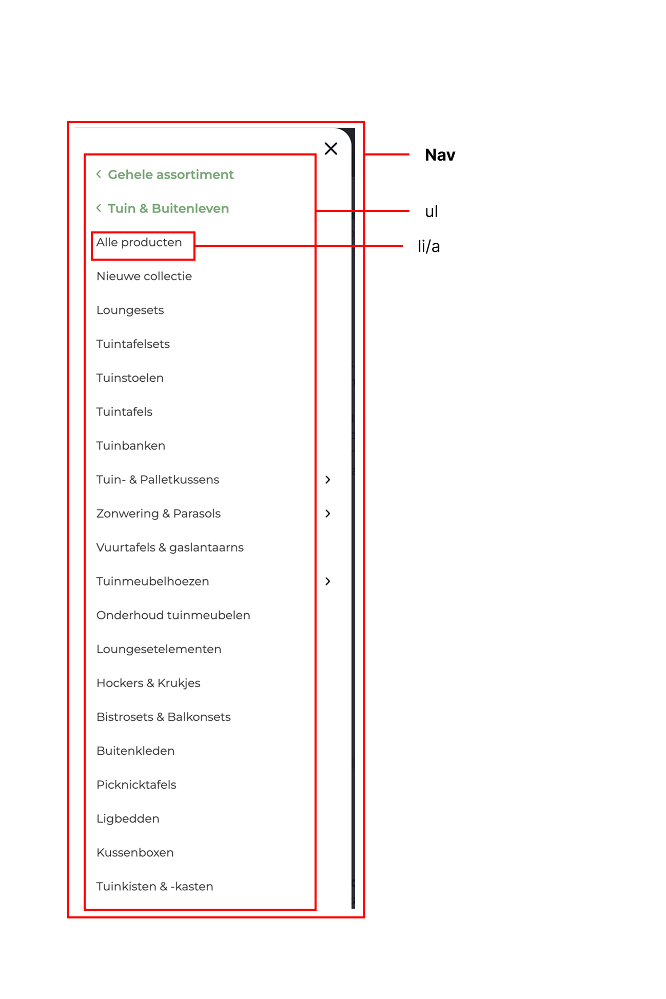

## Voortgang 1 (week 2)

  
uitwerken voor 1e voortgang

  ### Stand van zaken
  Ik heb een best wel prima deel al gemaakt van de website. Sommige dingen waren makkelijk, zoals de 3 info-knoppen maken en andere 
  dingen waren lastiger, zoals de populaire categoriën sectie, waarbij je een afbeelding moest kunnen swipen met een groene vlak tekst ervoor. Uiteindelijk is dit wel gelukt.

  ### Agenda voor meeting
  samen met je groepje opstellen

  Ik (Sander): Ik wil een paar dingen vragen over mijn HTML code.

  Ryan: Ik heb een vraag over hoe ik bepaalde elementen goed lay-out.

  Lois: Ik heb een vraag over waarom er witruimte ontstaat op mijn website rechts van het scherm.

  Job: Ik heb geen vragen.

  ### Verslag van meeting
  hier na afloop snel de uitkomsten van de meeting vastleggen

  - Te veel classes gebruikt, dit kan weg en met nth worden opgepakt.
  - Populaire Categoriën sectie met section ul li a maken ipv div
  - Minder div's gebruiken
  - Span's aanpassen

## Voortgang 2 (week 3)

  
uitwerken voor 2e voortgang

  ### Stand van zaken
  Het stijlen van de website samen met het positioneren van de elementen gingen meestal goed, soms wat lastige dingen om tekst bijvoorbeeld op een image en op de goede plek neer te zetten. Ik heb al best veel van de eerste pagina af, alleen moet er nog wel veel gebeuren. 

  ### Agenda voor meeting
  samen met je groepje opstellen

  | student 1      | student 2          | student 3    | student 4        |
  | ---            | ---                | ---          | ---              |
  | dit bespreken  | en dit             | en ik dit    | en dan ik dat    |
  | en dat ook nog | dit als er tijd is | nog een punt | dit wil ik zeker |
  | ...            | ...                | ...          | ...              |

  ### Verslag van meeting
  hier na afloop snel de uitkomsten van de meeting vastleggen

  - punt 1
  - punt 2
  - nog een punt
- ...

## Toegankelijkheidstest 2/2 (week 4)

  
uitwerken na test in 9e werkgroep

  ### Bevindingen
  Lijst met je bevindingen die in de test naar voren kwamen (geef ook aan wat er verbeterd is):
  - Er was geen zichtbare focus style voor interactieve elementen dat genavigeerd was via het toetsenbord, zoals de a links, buttons en de summaries. Dat heb ik gefixt door de :focus state aan die interactieve elementen toe te voegen.
  - 'Check of de dark / light mode ondersteund wordt.' -> Er was geen dark mode bij de echte website, in de checklist was hierdoor ook 'No' omcirkeld. Maar ik heb dit naderhand toegevoegd aan mijn eigen website.
  - Niet alle images hadden een alt attribute. Dat heb ik aangepast, zodat dit wel het geval is voor alle images.

## Voortgang 3 (week 4)

  
uitwerken voor 3e voortgang

  ### Stand van zaken
  De eerste pagina is afgerond en ben al begonnen met de tweede pagina. De footer was lastig om te maken. Ook alles responsive maken nadat de pagina klaar was, was een lastige taak, maar wel gelukt. Nu nog de tweede pagina helemaal afmaken en dit ook weer responsive maken. De focus states, dark mode en de alt teksten heb ik allemaal verwerkt. Het eindresultaat komt in zicht en ik ben trots op wat ik heb gemaakt.

  ### Agenda voor meeting
  samen met je groepje opstellen

  | student 1      | student 2          | student 3    | student 4        |
  | ---            | ---                | ---          | ---              |
  | dit bespreken  | en dit             | en ik dit    | en dan ik dat    |
  | en dat ook nog | dit als er tijd is | nog een punt | dit wil ik zeker |
  | ...            | ...                | ...          | ...              |

  ### Verslag van meeting
  hier na afloop snel de uitkomsten van de meeting vastleggen

  - punt 1
  - punt 2
  - nog een punt
  - ...

## Eindgesprek (week 5)

uitwerken voor eindgesprek

### Je uitkomst - karakteristiek screenshots:

Link naar mijn definitieve website: (https://sanderdb18.github.io/Definitieve-Tuincentrum-website/)

---------------------------------------------------------------------------------------------------

  Hieronder zie je mijn homepagina op mobile formaat op light mode:
  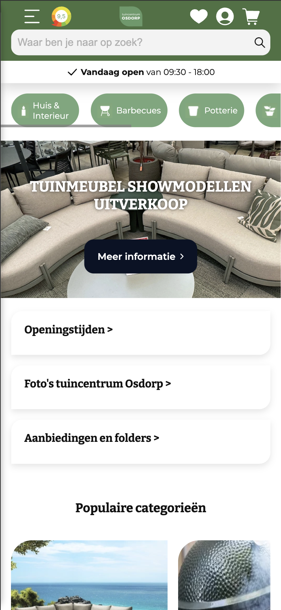

  Hieronder zie je mijn homepagina op desktop formaat op light mode:

  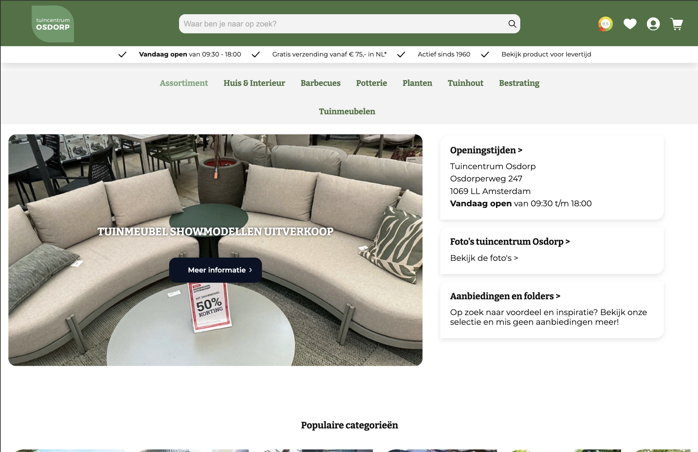

  Hieronder zie je mijn homepagina op mobile formaat op dark mode:

  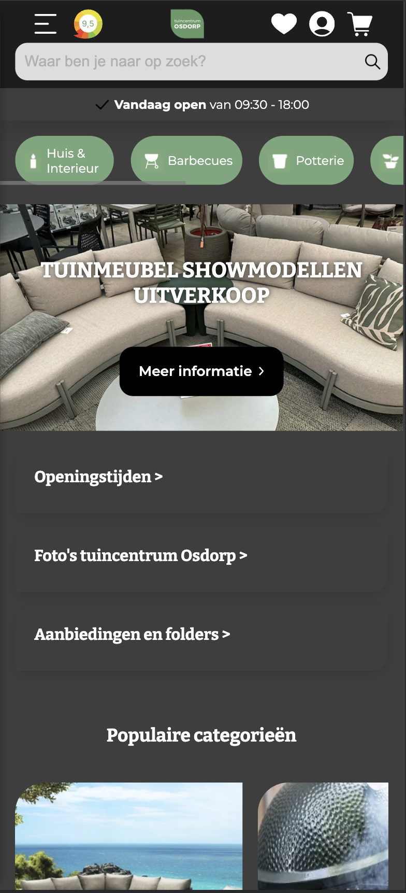

  Hieronder zie je mijn homepagina op desktop formaat op dark mode:

  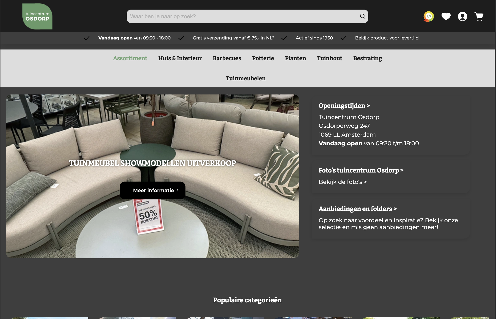

---------------------------------------------------------------------------------------------------

  Hieronder zie je mijn tuinmeubelen pagina op mobile formaat op light mode:

  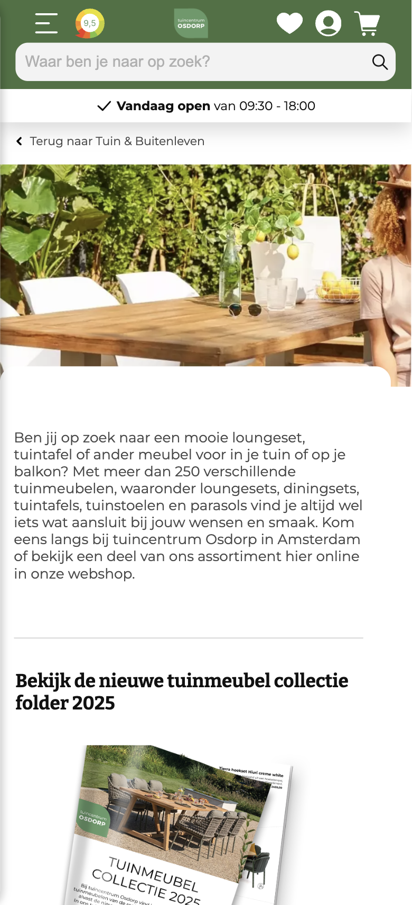

  Hieronder zie je mijn tuinmeubelen pagina op desktop formaat op light mode:

  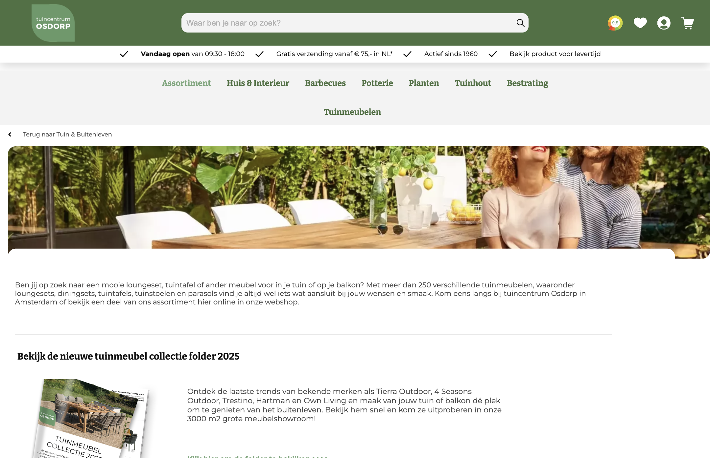

  Hieronder zie je mijn tuinmeubelen pagina op mobile formaat op dark mode:

  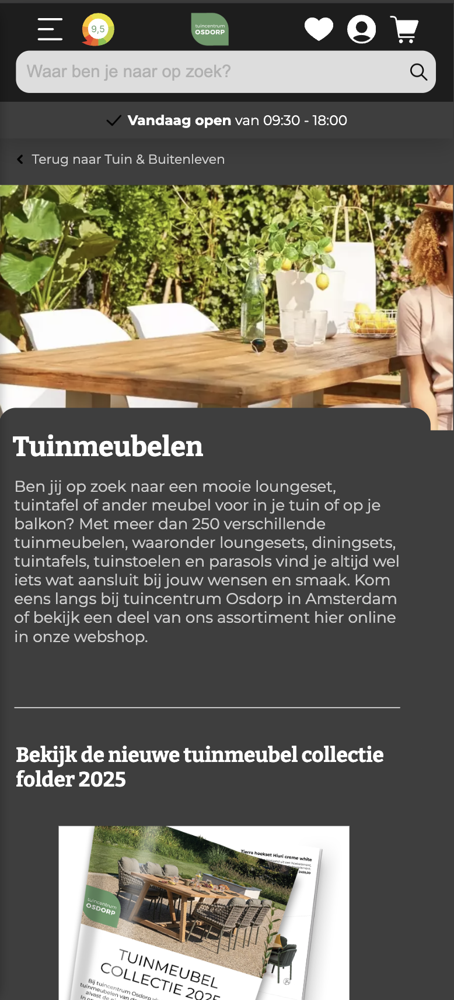

  Hieronder zie je mijn tuinmeubelen pagina op desktop formaat op dark mode:

  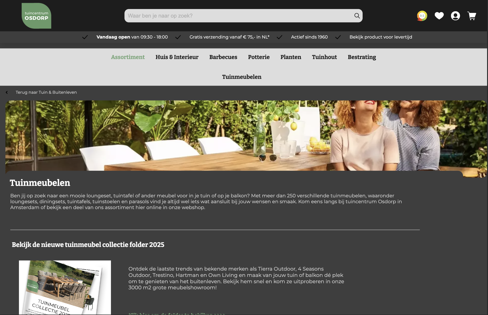

---------------------------------------------------------------------------------------------------

  Hieronder zie je mijn menu uitgeklapt op mobile formaat op light mode:

  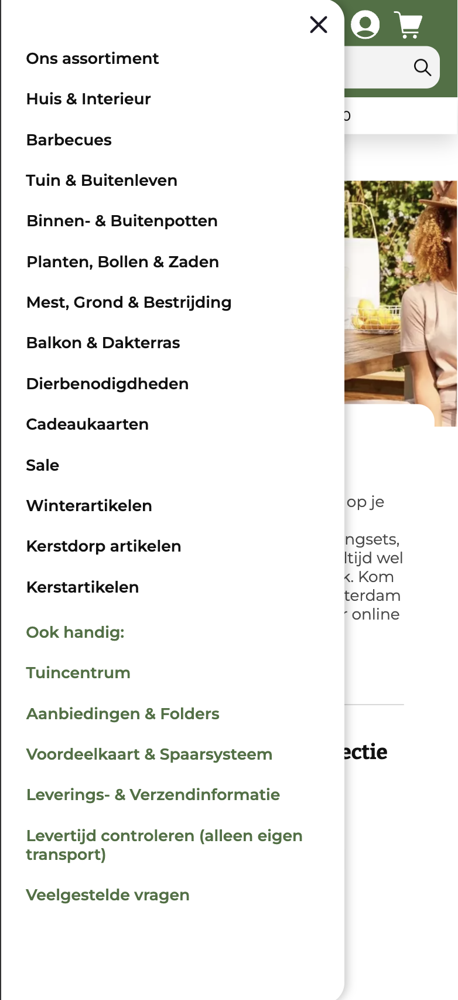

  Hieronder zie je mijn menu uitgeklapt op mobile formaat op dark mode:

  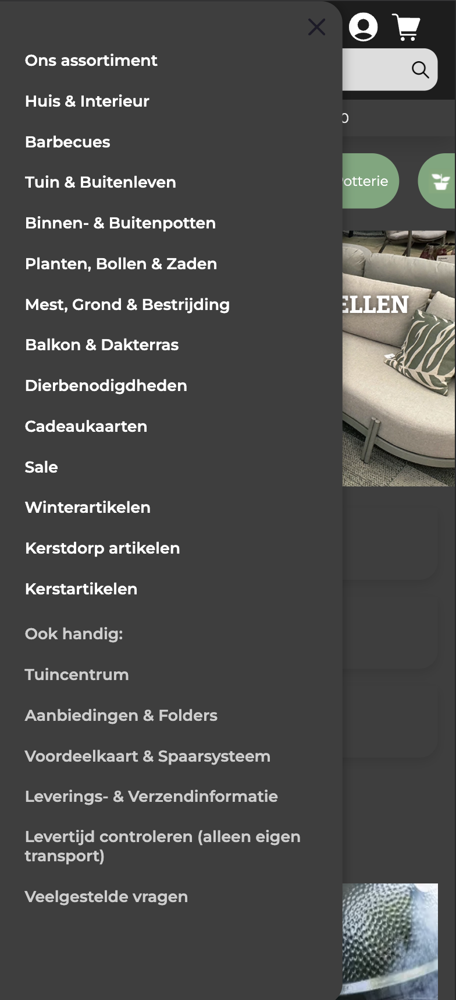

---------------------------------------------------------------------------------------------------

   ### Dit ging goed/Heb ik geleerd: 
  Korte omschrijving:

  Heel veel onderdelen van de website gingen gelukkig goed, zoals met verschillende html elementen werken en het targetten van elementen met nth met css. Ik heb verder geleerd over het gebruik van flexbox, hoe ik light en darkmode op de website kan zetten, hoe ik met nth kan werken om alles zo veel mogelijk zonder classes te doen, hoe ik de website responsive kan maken dat werkt op elk schermformaat met behulp van media queries, maar eingelijk heb ik van elk stuk code veel geleerd.

  ### Dit was lastig/Is niet gelukt:
  Korte omschrijving:

  Andere dingen zoals bepaalde tekst op een image krijgen ging wel stukken lastiger en ook om alles goed te positioneren. Uiteindelijk is dit wel allemaal gelukt hoe ik het ook wilde hebben. De JS dingen zoals de slider van merken dat was ook een uitdaging. Uiteindelijk wel gelukt gelukkig. Maar ook de headerbalk laten bewegen voor de micro interactie was lastig om te maken en als laatste de hamburgermenu. Er is wel 1 ding wat niet is gelukt en dat is dezelfde footer van de eerste pagina precies hetzelfde willen hebben op de 2e pagina. Het klinkt makkelijk, omdat je het gewoon kan kopiëren, maar ik heb alles geprobeerd alleen niks wilde werken. Dus dat is wel jammer.

## Bronnenlijst

  
continu bijhouden terwijl je werkt

  Nb. Wees specifiek ('css-tricks' als bron is bijv. niet specifiek genoeg). 
  Nb. ChatGpT en andere AI horen er ook bij.
  Nb. Vermeld de bronnen ook in je code.

  1. https://chatgpt.com/
  2. https://css-tricks.com/snippets/css/a-guide-to-flexbox/
  3. https://developer.mozilla.org/en-US/docs/Web/CSS/position
  4. https://developer.mozilla.org/en-US/docs/Web/CSS/::before
  5. https://developer.mozilla.org/en-US/docs/Web/CSS/overflow-x
  5. https://www.w3schools.com/tags/att_input_placeholder.asp 
  6. https://www.w3schools.com/css/css3_mediaqueries_ex.asp 
  7. https://developer.mozilla.org/en-US/docs/Web/CSS/z-index

